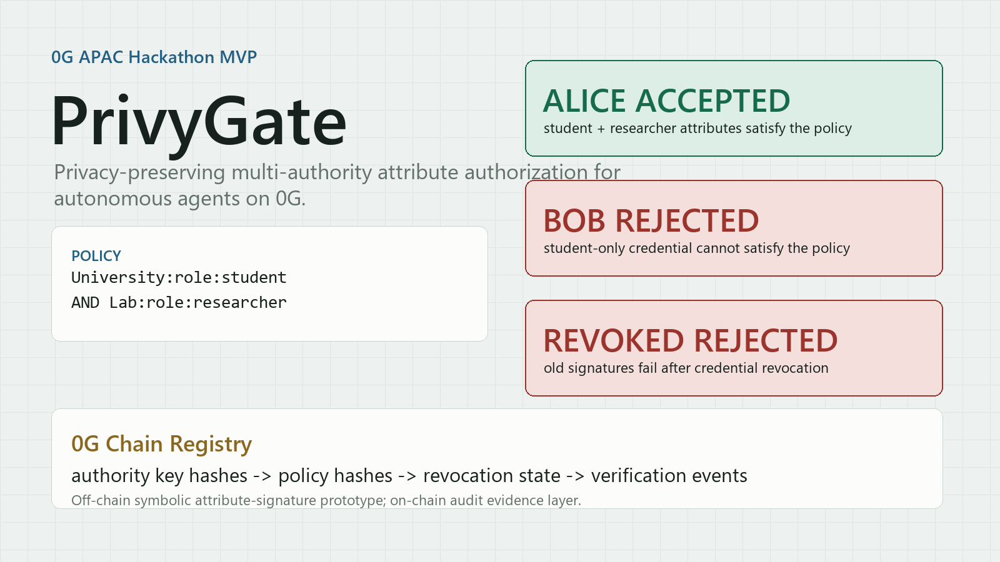

# PrivyGate

Privacy-preserving multi-authority attribute authorization for autonomous agents on 0G.



PrivyGate is a research prototype for decentralized multi-authority attribute-signature authorization. It lets a user or agent operator prove that they satisfy a policy such as `University:role:student AND Lab:role:researcher` without exposing their real identity or full credential set.

## Problem

Autonomous agents and Web3 applications increasingly need to decide whether a requester can call a sensitive tool, access a dataset, or enter a workflow. A wallet address is too coarse, and asking users to reveal full identity documents or all credentials is too invasive.

Real permissions often come from multiple independent institutions:

- a university confirms student status;
- a lab confirms researcher status;
- a DAO confirms membership;
- a compliance provider confirms KYC or jurisdiction status.

PrivyGate turns these independent attributes into a policy-based authorization proof.

## Solution

The prototype supports this flow:

1. Multiple authorities generate independent keys and register public key hashes.
2. Authorities issue attribute credentials to a user or agent operator.
3. A resource owner defines a threshold policy over attributes.
4. The requester generates an attribute signature for a specific tool call.
5. PrivyGate verifies that the signature satisfies the policy.
6. A registry contract records authority keys, policy hashes, revocation state, and verification events.
7. A storage audit manifest captures the policy-bound authorization decision for 0G Storage persistence.

The heavy cryptographic workflow stays off-chain. 0G Chain is used as an auditable registry layer, and 0G Storage is used for the audit-manifest persistence path.

## Why 0G

PrivyGate fits 0G as an authorization layer for autonomous agents:

- 0G Chain can provide tamper-evident registry state for authorities, policies, revocations, and verification events.
- 0G Storage can persist authorization audit manifests, policy metadata, and redacted agent access records.
- Agent workflows can call PrivyGate before invoking protected tools.

For the 0G submission, the integration is:

1. deploy `PrivyGateRegistry` on 0G Chain;
2. register demo authorities and policy hashes;
3. record one successful verification event;
4. record one revocation event and a failed verification event after revocation;
5. generate and upload a redacted 0G Storage audit manifest for the agent authorization decision;
6. publish the contract address, Explorer links, Storage root hash, and storage audit manifest evidence.

## Repository Layout

| Path | Purpose |
|---|---|
| `src/privygate/` | Python research prototype for setup, credential issuance, signing, verification, and revocation |
| `tests/` | Python unit tests for the core, service layer, and submission helpers |
| `scripts/privygate_cli.py` | Recording-friendly agent authorization demo |
| `scripts/run_core_demo.py` | Minimal JSON demo |
| `scripts/generate_hackathon_assets.py` | Generates share-card assets for README, X, and video cover use |
| `scripts/generate_storage_audit_manifest.py` | Generates a redacted 0G Storage audit manifest for the demo authorization decision |
| `scripts/hackathon_readiness_check.py` | Checks public submission readiness |
| `scripts/update_submission_links.py` | Fills final GitHub, video, X, contract, and Explorer links into public materials |
| `storage/` | Optional 0G Storage upload helper for the generated audit manifest |
| `experiments/benchmark_core.py` | Benchmark script for prototype experiments |
| `app/api/` | Framework-independent service layer plus optional FastAPI route draft |
| `app/web/` | Dependency-free static web demo for judges and recordings |
| `contracts/contracts/PrivyGateRegistry.sol` | Minimal Solidity registry for 0G Chain integration |
| `contracts/test/` | Hardhat contract tests |
| `docs/engineering/` | System design, interfaces, and cryptographic backend boundary |
| `docs/hackathon/` | 0G submission plan, architecture, deployment notes, video script, and media assets |

## Demo

The most useful demo command for a recording is:

```powershell
$env:PYTHONPATH='src'
python .\scripts\privygate_cli.py
```

Expected flow:

- Alice has both `University:role:student` and `Lab:role:researcher`.
- Alice's agent can call `private-dataset.read`.
- Bob has only `University:role:student` and cannot sign for the policy.
- Alice's old signature fails after her `Lab:role:researcher` credential is revoked.

Machine-readable output is available with:

```powershell
$env:PYTHONPATH='src'
python .\scripts\privygate_cli.py --json
```

The static web demo can be opened directly without a build step:

```text
app/web/index.html
```

Generate the 0G Storage audit manifest:

```powershell
$env:PYTHONPATH='src'
python .\scripts\generate_storage_audit_manifest.py
```

## Media Assets

Generated public assets are available under `docs/hackathon/assets/`:

- `privygate-share-card.png`: 16:9 card for README, project preview, and video cover.
- `privygate-mobile-story.png`: vertical card for social posts or short-form video.

Regenerate them with:

```powershell
python .\scripts\generate_hackathon_assets.py
```

## Run Tests

The Python prototype uses only the standard library.

```powershell
$env:PYTHONPATH='src'
python -m unittest discover -s tests -v
```

Current local result:

```text
Ran 18 tests
OK
```

## Run the Benchmark

```powershell
$env:PYTHONPATH='src'
python .\experiments\benchmark_core.py
```

The benchmark writes generated CSV data to `experiments/results/`, which is intentionally ignored by Git.

## Submission Readiness

Check external dependencies before Hardhat testing or 0G deployment:

```powershell
python .\scripts\external_dependency_check.py
```

Run the hackathon readiness report before publishing links or filling the final form:

```powershell
python .\scripts\hackathon_readiness_check.py
```

Use strict mode before final submission:

```powershell
python .\scripts\hackathon_readiness_check.py --strict
```

## Contract Workflow

The registry contract is in `contracts/contracts/PrivyGateRegistry.sol`.

```powershell
cd contracts
npm install
npm test
```

Deploy to 0G mainnet after filling the environment variables. The template uses Chain ID `16661`, RPC `https://evmrpc.0g.ai`, and Explorer `https://chainscan.0g.ai`.

```powershell
copy .env.example .env
# Fill OG_PRIVATE_KEY. Keep OG_RPC_URL, OG_CHAIN_ID, and OG_EXPLORER_URL unless 0G updates them.
npm run check:og
npm run deploy:og
```

Record demo events after deployment:

```powershell
$env:PRIVYGATE_REGISTRY_ADDRESS='<deployed-address>'
npm run record:demo:og
```

For a Galileo testnet rehearsal, fill the `OG_GALILEO_*` variables and run:

```powershell
npm run check:og:galileo
npm run deploy:og:galileo
npm run record:demo:og:galileo
```

Do not commit `.env` or private keys.

## 0G Evidence

Current status: 0G mainnet deployment complete; 0G Storage audit manifest uploaded and recorded.

| Evidence | Value |
|---|---|
| 0G contract address | `0x1b55C901A69fE53a70F0011579d3576684FAAdc0` |
| Explorer link | [explorer](https://chainscan.0g.ai/address/0x1b55C901A69fE53a70F0011579d3576684FAAdc0) |
| Deploy tx | https://chainscan.0g.ai/tx/0xa28e74c61c34c8652a07845d5fca6f443d816487ca85e7576c44839576259251 |
| Authority registration tx | [authority tx](https://chainscan.0g.ai/tx/0x64c8563ca32e96f8949aad0b348abc354adedb38fed103b5deae5af7b7748d5f) |
| Policy registration tx | [policy tx](https://chainscan.0g.ai/tx/0x4846aa7e3a522281666ab181cdb66c7ae787c59ad0d557bf29718decd8906c21) |
| Verification success tx | [verification success](https://chainscan.0g.ai/tx/0x5fdfeb82d5fcd30863fb245a0ce2c7e0922f6aea2a7b68989beac976b7159ab0) |
| Revocation tx | [revocation](https://chainscan.0g.ai/tx/0xcf406dfbc72c86abe86c380eb341077523e07a6a6925b1bce0cecb78427abd55) |
| Verification failure tx | [verification failure](https://chainscan.0g.ai/tx/0x2f26b9630ecc42c1fdfef41e2d3af1e1c0611d6028406d30d271adbd1fa1dfcf) |
| Storage audit manifest | `docs/hackathon/privygate_0g_storage_audit_manifest.json` |
| Storage audit manifest hash | `e760bad9008f6beea01e9d005209db8bcec83953ac38ed96cc3fa11df39aa64f` |
| 0G Storage root hash | `0xe8cc7ce846e8952caa41f491041dbd424d89dd762f55b9e7482f36295d252e8f` |
| 0G Storage tx | https://chainscan.0g.ai/tx/0xdc192a3713bb96baad3880c1dce0c1a089d3b9b02c6783d1d4afa990960ac66f |
| Storage upload helper | `storage/upload-audit.mjs` |

## 0G Storage Audit Package

The generated manifest is a redacted audit package for the demo authorization decision. It contains the policy, public authority key hashes, Alice/Bob/revocation decision records, public 0G Chain evidence, and an explicit cryptographic boundary note. It does not contain private keys, seed phrases, raw identity documents, or raw attribute secret components.

Generate it locally:

```powershell
$env:PYTHONPATH='src'
python .\scripts\generate_storage_audit_manifest.py
```

Optional upload path:

```powershell
cd storage
npm.cmd install
$env:OG_PRIVATE_KEY='0x...'
npm.cmd run upload:audit
```

After upload, record the returned 0G Storage root and transaction hash in the README and submission materials. Do not write them back into the uploaded manifest, because that would change the file content and invalidate the content-addressed root.

## Current Cryptographic Boundary

The current backend is `symbolic-field-v1`. It models the exponent relationships used in a pairing-based attribute-signature design and validates the workflow, interfaces, tests, demo flow, and thesis experiments.

It is not production cryptography. The next cryptographic step is to evaluate a real pairing backend such as `py_ecc` or Charm-Crypto and replace the symbolic field elements with serialized group elements and pairing checks.
