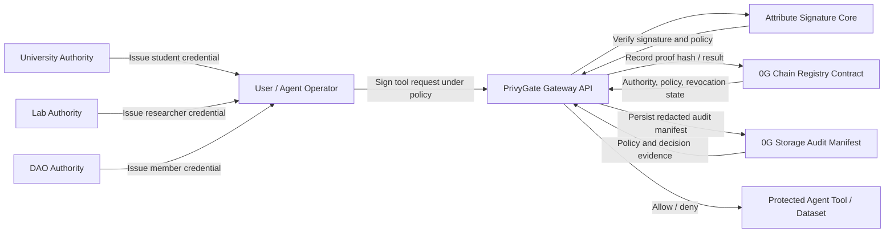

# PrivyGate Architecture

最后更新：2026-05-04

## One-Line Architecture

PrivyGate keeps heavy attribute-signature logic off-chain, while 0G Chain stores authority, policy, revocation, and verification audit records, and 0G Storage persists redacted authorization audit manifests.

## Components

## Runtime Flow

1. Authorities register public key hashes on the registry contract.
2. Authorities issue off-chain attribute credentials to a user or agent operator.
3. A resource owner creates a policy, such as `University:role:student AND Lab:role:researcher`.
4. The policy hash is registered on-chain.
5. The user signs a specific message or agent tool request.
6. PrivyGate verifies the signature against the policy and authority public keys.
7. PrivyGate checks revocation state.
8. PrivyGate records the verification result hash on-chain.
9. PrivyGate generates a redacted storage audit manifest for the authorization decision.
10. The protected tool is allowed only if verification succeeds.

## Trust Boundary

| Layer | Responsibility | Notes |
|---|---|---|
| Python core | Attribute credential issuing, signing, verification | Current backend is symbolic-field-v1 research prototype |
| API gateway | Exposes policy, signing, verification, revocation operations | Service layer is implemented; FastAPI dependency pending |
| 0G Chain contract | Authority registry, policy hashes, revocation state, verification logs | Minimal Solidity contract exists |
| 0G Storage audit package | Redacted policy-bound decision manifest | Uploaded to 0G Storage; root hash and transaction evidence recorded |
| Frontend / demo | Shows the authorization workflow | Static demo implemented in `app/web/` |

## What Is Public

- Authority IDs.
- Authority public key hashes.
- Policy hashes.
- Credential revocation hashes.
- Verification event hashes and results.
- Redacted audit manifest fields and manifest hash.

## What Stays Private

- User real identity.
- Full user attribute set.
- Attribute secret components.
- Off-chain message contents when only hashes are recorded.
- Private keys, seed phrases, raw identity documents, and raw attribute secret components.

## Hackathon Demo Mapping

| Demo Step | Component |
|---|---|
| Register University/Lab/DAO | `PrivyGateRegistry.registerAuthority` |
| Create policy | `registerPolicy` |
| Alice signs request | Python core / API service |
| Gateway verifies Alice | Python core / API service |
| Show Alice/Bob/revocation visually | Static web demo in `app/web/index.html` |
| Record verification | `recordVerification` |
| Revoke Alice researcher credential | `setRevoked` |
| Verify again and fail | Python core + registry revocation state |
| Generate storage audit package | `scripts/generate_storage_audit_manifest.py` |
| Upload audit package | `storage/upload-audit.mjs` optional helper |
